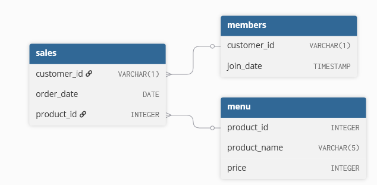

## Case Study 1: Danny's Diner -- Customer Insights
Dataset and case study from https://8weeksqlchallenge.com/case-study-1/

### Introduction
Danny’s Diner is in need of your assistance to help the restaurant stay afloat - the restaurant has captured some very basic data from their few months of operation but have no idea how to use their data to help them run the business.

Danny wants to use the data to answer a few simple questions about his customers, especially about their **visiting patterns**, **how much money they’ve spent** and also **which menu items are their favourite**. Having this deeper connection with his customers will help him deliver a better and more personalised experience for his loyal customers.

He plans on using these insights to help him decide **whether he should expand the existing customer loyalty program** - additionally he needs help to **generate some basic datasets so his team can easily inspect the data without needing to use SQL**.

### Entity Relationship Diagram


### Case Study Questions
1. What is the total amount each customer spent at the restaurant? 
    <details close>
    <summary>Code</summary>

    ```
    SELECT s.customer_id, SUM(m.price) AS total_amount
    FROM dannys_diner.sales s
    LEFT JOIN dannys_diner.menu m ON s.product_id = m.product_id
    GROUP BY customer_id;
    ```

    </details>

    | customer_id | total_amount |
    | ------- | ------- |
    | A | 76 |
    | B | 74 |
    | C | 36 |

    Customers A, B and C spent $76, $74 and $36 respectively.

    *This can help to answer Danny's question on how much money that each customer has spent in the restaurant.*

2. How many days has each customer visited the restaurant?
    <details close>
    <summary>Code</summary>

    ```
    SELECT customer_id, COUNT(DISTINCT order_date) as days_visited
    FROM dannys_diner.sales
    GROUP BY customer_id;
    ```

    </details>
    
    | customer_id | days_visited |
    | ------- | ------- |
    | A | 4 |
    | B | 6 |
    | C | 2 |

    Customers A, B and C visited for 4, 6 and 2 separate days respectively.

    *Combined with the insight obtained in Question 1, Danny will be able to analyze the relationship between the visiting frequency and spending rate of each customer. A further deepdive could be to analyze the overall daily visiting frequency to examine which days are customers more likely to visit the restaurant.*

3. What was the first item from the menu purchased by each customer?
    <details close>
    <summary>Code</summary>

    ```
    WITH EarliestOrder AS (
	SELECT s.customer_id, MIN(s.order_date) AS earliest_order
	FROM dannys_diner.sales s
	GROUP BY s.customer_id
    )
    SELECT customer_id, product_name
    FROM dannys_diner.sales s1
    LEFT JOIN dannys_diner.menu m ON s1.product_id = m.product_id
    WHERE (s1.customer_id, s1.order_date) IN (
        SELECT customer_id, earliest_order
        FROM EarliestOrder
    )
    GROUP BY customer_id, product_name;
    ```

    </details>

    | customer_id | product_name |
    | ------- | ------- |
    | A | sushi |
    | A | curry |
    | B | curry |
    | C | ramen |

    The first purchase is considered to occur on the earliest purchase date for each customer. For Customer A, this logic returns both sushi and curry as they were purchased on the same day. As the data is lacking a timestamp, both items are considered as their first purchase. Customers B and C bought curry and ramen for their first purchases.

    *This data can be used to determine the most attractive product for first-time customers, and thus help to analyze what products to promote to attract potential customers.*

4. What is the most purchased item on the menu and how many times was it purchased by all customers?
    <details close>
    <summary>Code</summary>

    ```
    SELECT s.product_id, m.product_name, COUNT(order_date) as times_ordered
    FROM dannys_diner.sales s
    LEFT JOIN dannys_diner.menu m ON s.product_id = m.product_id
    GROUP BY s.product_id, m.product_name
    ORDER BY times_ordered DESC
    LIMIT 1;
    ```

    </details>

    | product_id | product_name | times_ordered |
    | ------- | ------- | ------- |
    | 3 | ramen | 8

    The most purchased item on the menu was ramen, and it was purchased 8 times by customers.

    *As compared to Question 3, this data is used to determine the overall popularity of a product for first-time and repeating customers, and thus help to analyze what products to promote to maintain the customer base.*


5. Which item was the most popular for each customer?
    <details close>
    <summary>Code</summary>

    ```
    WITH CustomerRankings AS (
	SELECT s1.customer_id, s1.product_id, m.product_name, times_ordered_per_product, DENSE_RANK() OVER (PARTITION BY customer_id ORDER BY times_ordered_per_product desc) as customer_ranking
	FROM (
		SELECT customer_id, product_id, COUNT(product_id) OVER (PARTITION BY customer_id, product_id) as times_ordered_per_product
		FROM dannys_diner.sales s
	) AS s1
	LEFT JOIN dannys_diner.menu m ON s1.product_id = m.product_id
    )
    SELECT customer_id, product_name, times_ordered_per_product
    FROM CustomerRankings
    WHERE customer_ranking = 1
    GROUP BY customer_id, product_name, times_ordered_per_product;
    ```

    </details>

    | customer_id | product_name | times_ordered_per_product |
    |-------------|--------------|---------------------------|
    | A           | ramen        | 3                         |
    | B           | sushi        | 2                         |
    | B           | curry        | 2                         |
    | B           | ramen        | 2                         |
    | C           | ramen        | 3                         |

    For Customer A and C, the most popular item was ramen, which was ordered 3 times each. Customer B has ordered sushi, curry and ramen an equal number of times.
    
    *As compared to Question 4, this presents the most popular item for each customer, as opposed to the overall most popular item.*

6. Which item was purchased first by the customer after they became a member?
    <details close>
    <summary>Code</summary>

    ```
    WITH FirstOrder AS (
	SELECT customer_id, MIN(order_date) as first_order_date
	FROM (
		SELECT s.customer_id, s.order_date, s.product_id, members.join_date
		FROM dannys_diner.sales s
		LEFT JOIN dannys_diner.members members ON s.customer_id = members.customer_id
		WHERE members.join_date <= s.order_date
	) AS s1
	GROUP BY customer_id
    )
    SELECT customer_id, order_date, product_name
    FROM dannys_diner.sales s1
    LEFT JOIN dannys_diner.menu ON s1.product_id = menu.product_id
    WHERE (s1.customer_id, s1.order_date) IN (
        SELECT customer_id, first_order_date
        FROM FirstOrder
        );
    ```

    </details>

    | customer_id | order_date | product_name |
    |-------------|------------|--------------|
    | A           | 2021-01-07 | curry        |
    | B           | 2021-01-11 | sushi        |

    Customer A purchased curry while Customer B purchased sushi after they had become members. Customer C was excluded as they have not become a member yet.

    *This data can be used to analyze what product incentivised the customers to join the loyalty programme.*

7. Which item was purchased just before the customer became a member?
    <details close>
    <summary>Code</summary>

    ```
    WITH LastOrder AS (
	SELECT customer_id, MAX(order_date) AS last_order_date
	FROM (
		SELECT s.customer_id, s.order_date, s.product_id, members.join_date
		FROM dannys_diner.sales s
		LEFT JOIN dannys_diner.members members ON s.customer_id = members.customer_id
		WHERE members.join_date > s.order_date
	) AS s1
	GROUP BY customer_id
    )
    SELECT customer_id, order_date, product_name
    FROM dannys_diner.sales s1
    LEFT JOIN dannys_diner.menu ON s1.product_id = menu.product_id
    WHERE (s1.customer_id, s1.order_date) IN (
        SELECT customer_id, last_order_date
        FROM LastOrder
        );
    ```

    </details>


    | customer_id | order_date | product_name |
    |-------------|------------|--------------|
    | A           | 2021-01-01 | sushi        |
    | A           | 2021-01-01 | curry        |
    | B           | 2021-01-04 | sushi        |

    Customer A bought sushi and curry before becoming a member, while Customer B bought sushi. Customer C was excluded as they have not become a member yet.


8. What is the total items and amount spent for each member before they became a member?
    <details close>
    <summary>Code</summary>

    ```
    SELECT customer_id, COUNT(price) as total_items, SUM(price) AS total_amount
    FROM (
        SELECT s.customer_id, s.order_date, s.product_id, members.join_date, menu.price
        FROM dannys_diner.sales s
        LEFT JOIN dannys_diner.members members ON s.customer_id = members.customer_id
        LEFT JOIN dannys_diner.menu menu ON s.product_id = menu.product_id
        WHERE members.join_date > s.order_date
        ) AS s1
    GROUP BY customer_id;
    ```

    </details>

    | customer_id | total_items | total_amount |
    |-------------|------------|--------------|
    | A | 2 | 25 |
    | B | 3 | 40 |

    Customer A spent on 2 items for a total of $25, while Customer B spent on 3 items for a total of $40.


9. If each $1 spent equates to 10 points and sushi has a 2x points multiplier - how many points would each customer have?

    <details close>
    <summary>Code</summary>

    ```
    SELECT customer_id, SUM(points) as total_points
    FROM (
        SELECT s.customer_id, s.order_date, s.product_id, members.join_date, menu.product_name, menu.price, CASE WHEN s.product_id = 1 THEN menu.price*20 ELSE menu.price*10 END AS points
        FROM dannys_diner.sales s
        LEFT JOIN dannys_diner.members members ON s.customer_id = members.customer_id
        LEFT JOIN dannys_diner.menu menu ON s.product_id = menu.product_id
        WHERE members.join_date <= s.order_date OR members.join_date IS NULL
    ) AS s1
    GROUP BY customer_id;
    ```

    </details>

    | customer_id | total_points |
    |-------------|------------|
    | A | 510 |
    | B | 440 |
    | C | 360 |

    Customers A, B and C would have a total of 510, 440 and 360 points respectively.

10. In the first week after a customer joins the program (including their join date) they earn 2x points on all items, not just sushi - how many points do customer A and B have at the end of January?
    <details close>
    <summary>Code</summary>

    ```
    SELECT customer_id, SUM(points) as total_points
    FROM (
        SELECT s.customer_id, 
        s.order_date, 
        s.product_id, 
        members.join_date, 
        menu.product_name, 
        menu.price, 
        CASE 
            WHEN DATEDIFF(order_date, join_date) < 7 THEN menu.price*20
            WHEN s.product_id = 1 THEN menu.price*20 
            ELSE menu.price*10 
        END AS points
        FROM dannys_diner.sales s
        LEFT JOIN dannys_diner.members members ON s.customer_id = members.customer_id
        LEFT JOIN dannys_diner.menu menu ON s.product_id = menu.product_id
        WHERE members.join_date <= s.order_date AND s.order_date <= '2021-01-31'
    ) AS s1
    GROUP BY customer_id;
    ```

    </details>

    | customer_id | total_points |
    | ------- | ------- |
    | A | 1020 |
    | B | 320 |

    At the end of January, Customer A has 1020 points and Customer B has 320 points.

11. Bonus question: Join all datasets for quick insights
    The following questions are related creating basic data tables that Danny and his team can use to quickly derive insights without needing to join the underlying tables using SQL.

    <details close>
    <summary>Code</summary>

    ```
    USE `dannys_diner`;
    CREATE TABLE joinallthings (
    customer_id VARCHAR(1),
    order_date DATE,
    product_name VARCHAR(500),
    price INTEGER,
    `member` VARCHAR(1)
    );

    INSERT INTO dannys_diner.joinallthings (customer_id, order_date, product_name, price, `member`)
    SELECT s.customer_id, s.order_date, menu.product_name, menu.price, CASE WHEN members.join_date <= s.order_date THEN 'Y' ELSE 'N' END AS `member`
    FROM dannys_diner.sales s
    LEFT JOIN dannys_diner.members members ON s.customer_id = members.customer_id
    LEFT JOIN dannys_diner.menu menu ON s.product_id = menu.product_id;

    SELECT *
    FROM dannys_diner.joinallthings;
    ```

    </details>

    | customer_id | order_date | product_name | price | member |
    | ------- | ------- | ------- | ------- | ------- |
    | A	| 2021-01-01 | sushi | 10 | N 
    | A	| 2021-01-01 | curry | 15 | N 
    | A	| 2021-01-07 | curry | 15 | Y 
    | A	| 2021-01-10 | ramen | 12 | Y 
    | A	| 2021-01-11 | ramen | 12 | Y 
    | A	| 2021-01-11 | ramen | 12 | Y 
    | B	| 2021-01-01 | curry | 15 | N  
    | B	| 2021-01-02 | curry | 15 | N  
    | B	| 2021-01-04 | sushi | 10 | N 
    | B	| 2021-01-11 | sushi | 10 | Y 
    | B	| 2021-01-16 | ramen | 12 | Y 
    | B	| 2021-02-01 | ramen | 12 | Y 
    | C	| 2021-01-01 | ramen | 12 | N  
    | C	| 2021-01-01 | ramen | 12 | N  
    | C	| 2021-01-07 | ramen | 12 | N 

    The 3 tables (sales, members and menu) were joined together into a single table. Each row shows the purchase record of a customer (who made the purchase, what was purchased, when it was purchased, how much was the purchase and whether the customer was a member).

    _By consolidating all data into a single table, Danny's team will be able derive insights without using SQL, thus making data analysis more accessible._

12. **Bonus question: Ranking of customer products for customers in the loyalty program**

    Danny also requires further information about the ranking of customer products, but he purposely does not need the ranking for non-member purchases so he expects null ranking values for the records when customers are not yet part of the loyalty program.

    <details close>
    <summary>Code</summary>

    ```
    USE `dannys_diner`;
    CREATE TABLE rankallthings (
    customer_id VARCHAR(1),
    order_date DATE,
    product_name VARCHAR(500),
    price INTEGER,
    `member` VARCHAR(1),
    ranking INTEGER
    );

    INSERT INTO dannys_diner.rankallthings (customer_id, order_date, product_name, price, `member`, ranking)
    SELECT *, 
        CASE 
            WHEN `member` ='N' THEN NULL 
            ELSE DENSE_RANK() OVER (PARTITION BY customer_id, `member` ORDER BY order_date) 
            END 
        AS ranking
    FROM dannys_diner.joinallthings;

    SELECT *
    FROM dannys_diner.rankallthings;
    ```

    </details>

    | customer_id | order_date | product_name | price | member | ranking |
    | ------- | ------- | ------- | ------- | ------- | ------- |
    | A	| 2021-01-01 | sushi | 10 | N | 
    | A	| 2021-01-01 | curry | 15 | N | 
    | A	| 2021-01-07 | curry | 15 | Y | 1
    | A	| 2021-01-10 | ramen | 12 | Y | 2
    | A	| 2021-01-11 | ramen | 12 | Y | 3
    | A	| 2021-01-11 | ramen | 12 | Y | 3
    | B	| 2021-01-01 | curry | 15 | N | 
    | B	| 2021-01-02 | curry | 15 | N | 
    | B	| 2021-01-04 | sushi | 10 | N | 
    | B	| 2021-01-11 | sushi | 10 | Y | 1
    | B	| 2021-01-16 | ramen | 12 | Y | 2
    | B	| 2021-02-01 | ramen | 12 | Y | 3
    | C	| 2021-01-01 | ramen | 12 | N | 
    | C	| 2021-01-01 | ramen | 12 | N | 
    | C	| 2021-01-07 | ramen | 12 | N | 

    The 'ranking' column displays the product rankings of each customer after they have become a member. The products are ranked according to the date in which they were bought. 
    
    _Possible further actions for this table will be to identify what customers buy immediately after joining the loyalty programme, or which products are more popular among members. This data can then be used to create new promoting strategies to encourage members to buy more of the specified products._